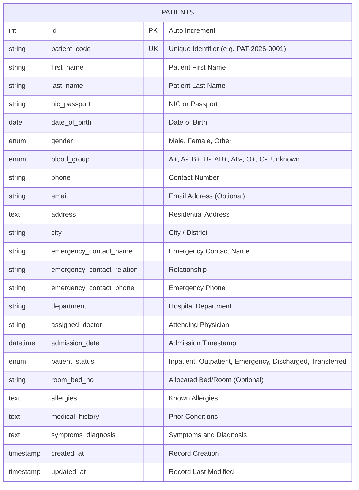

# IT22013 - Web System Technologies
## Hospital Patient Management System Using PHP and MySQL
### Comprehensive Project Report

---

**Course Module:** IT22013 - Web System Technologies  
**Project Title:** Hospital Patient Management System (HPMS)  
**Technologies:** PHP 8.x, MySQL / MariaDB, HTML5, CSS3, JavaScript  
**Target User:** Hospital Receptionist & Administrative Staff  

---

## Table of Contents
1. [Executive Summary](#1-executive-summary)
2. [Introduction & Problem Statement](#2-introduction--problem-statement)
3. [System Objectives & Scope](#3-system-objectives--scope)
4. [System Architecture & Technology Stack](#4-system-architecture--technology-stack)
5. [Database Design & Data Dictionary](#5-database-design--data-dictionary)
6. [Functional Modules & Implementation](#6-functional-modules--implementation)
7. [Security Implementation](#7-security-implementation)
8. [Testing & Quality Assurance](#8-testing--quality-assurance)
9. [Installation & Deployment Guide](#9-installation--deployment-guide)
10. [Conclusion & Future Enhancements](#10-conclusion--future-enhancements)

---

## 1. Executive Summary

The **Hospital Patient Management System (HPMS)** is a web-based healthcare management application designed to streamline receptionist operations in private clinics and hospitals. The application delivers an intuitive digital solution for maintaining patient records, eliminating cumbersome paper files, reducing registration turnaround times, and preventing data discrepancies.

Built using **PHP (PDO)** and **MySQL**, the system provides complete CRUD (Create, Read, Update, Delete) capabilities alongside multi-criteria search and dynamic filtering. Adhering to secure coding standards, all database interactions leverage prepared statements to thwart SQL injection, accompanied by XSS sanitization and CSRF protection.

---

## 2. Introduction & Problem Statement

### 2.1 Background
In healthcare administration, timely and accurate patient data retrieval is critical. Manual paperwork and legacy file systems suffer from notable weaknesses:
- Physical document misplacement and deterioration.
- Slow patient search during peak hours.
- Inability to quickly filter patients by attending doctor or department.
- High risk of data entry inconsistency and accidental record duplication.

### 2.2 Solution
The web-based Hospital Patient Management System provides receptionists with an interactive dashboard, quick admission workflows, and an instant directory lookup engine to oversee patient flows across departments (Cardiology, Pediatrics, Orthopedics, General Medicine, Neurology, etc.).

---

## 3. System Objectives & Scope

### 3.1 Primary Objectives
As stipulated in the IT22013 course assignment, the system fulfills five core functional requirements:
1. **Register a Patient**: Capture demographic, contact, emergency, and clinical information.
2. **View Patients**: Present records in a clean, paginated directory with real-time status badges.
3. **Update Patient Details**: Enable modification of existing patient records while maintaining data integrity.
4. **Delete Patient Records**: Provide secure deletion backed by modal confirmation dialogs.
5. **Search Specific Records**: Support multi-attribute search across Patient ID, Name, Phone, and NIC.

---

## 4. System Architecture & Technology Stack

```
+-------------------------------------------------------------+
|                      Client Browser                         |
|   (HTML5, Responsive CSS3 Design System, Vanilla JS)        |
+------------------------------+------------------------------+
                               | HTTP / HTTPS Requests
                               v
+-------------------------------------------------------------+
|                     PHP 8.x Web Layer                       |
|   - Routing & Controllers (index.php, patients.php, etc.)   |
|   - Input Validation & XSS Sanitization                     |
|   - Session & CSRF Management                               |
+------------------------------+------------------------------+
                               | PDO (Prepared Statements)
                               v
+-------------------------------------------------------------+
|                   MySQL / MariaDB Database                  |
|   - Database: hospital_db                                   |
|   - Table: patients (Indexed on code, name, phone, dept)    |
+-------------------------------------------------------------+
```

### 4.1 Technology Rationale
- **PHP 8 (PDO)**: Provides high performance, object-oriented database abstraction, parameter binding, and robust error handling.
- **MySQL / MariaDB**: ACID-compliant relational database ensuring relational integrity and fast indexing.
- **CSS3 Design System**: Custom medical color palette, responsive typography (`Plus Jakarta Sans`), CSS variables, and native `@media print` styling for medical card printouts.
- **Vanilla JavaScript**: Handles client-side date-of-birth age calculations, deletion confirmation modals, and real-time header clock synchronization without heavy dependencies.

---

## 5. Database Design & Data Dictionary

### 5.1 Database Entity Relationship (ERD)



### 5.2 Data Dictionary (`patients` Table)

| Field Name | Type | Null | Key | Description |
|---|---|---|---|---|
| `id` | INT(11) UNSIGNED | NO | PK | Auto-incrementing primary key |
| `patient_code` | VARCHAR(20) | NO | UNI | Unique patient identifier (e.g. `PAT-2026-0001`) |
| `first_name` | VARCHAR(50) | NO | | Patient first name |
| `last_name` | VARCHAR(50) | NO | | Patient surname/family name |
| `nic_passport` | VARCHAR(25) | YES | | National Identity Card or Passport Number |
| `date_of_birth` | DATE | NO | | Date of birth for age calculation |
| `gender` | ENUM('Male','Female','Other') | NO | | Patient gender |
| `blood_group` | ENUM('A+','A-','B+','B-','AB+','AB-','O+','O-','Unknown') | NO | | Blood type |
| `phone` | VARCHAR(20) | NO | MUL | Contact phone number |
| `email` | VARCHAR(100) | YES | | Patient email address |
| `address` | TEXT | NO | | Residential physical address |
| `city` | VARCHAR(50) | YES | | City or district (default: 'Colombo') |
| `emergency_contact_name` | VARCHAR(100) | NO | | Emergency contact person full name |
| `emergency_contact_relation` | VARCHAR(50) | NO | | Relationship to patient (e.g., Spouse, Parent) |
| `emergency_contact_phone` | VARCHAR(20) | NO | | Emergency contact telephone number |
| `department` | VARCHAR(50) | NO | MUL | Hospital department (Cardiology, Pediatrics, etc.) |
| `assigned_doctor` | VARCHAR(100) | NO | | Name of attending medical officer |
| `admission_date` | DATETIME | NO | | Date & time of registration or ward admission |
| `patient_status` | ENUM(...) | NO | MUL | Status: Inpatient, Outpatient, Emergency, Discharged |
| `room_bed_no` | VARCHAR(30) | YES | | Ward / Bed / Room number for inpatients |
| `allergies` | TEXT | YES | | Food or drug allergies |
| `medical_history` | TEXT | YES | | Pre-existing medical conditions |
| `symptoms_diagnosis` | TEXT | NO | | Presenting symptoms & preliminary diagnosis |
| `created_at` | TIMESTAMP | NO | | System creation timestamp |
| `updated_at` | TIMESTAMP | NO | | Automatic update timestamp |

---

## 6. Functional Modules & Implementation

### 6.1 Module 1: Dashboard (`index.php`)
- **Key Metrics Cards**: Summarizes Total Registered Patients, Active Inpatients, Outpatient Visits, and Emergency Cases.
- **Quick Patient Search**: Direct navigation shortcut to search records.
- **Recent Registrations**: Displays the 6 latest admitted patients with quick-action links.
- **Department Distribution**: Side widget tracking admissions per specialty department.

### 6.2 Module 2: Patient Registration (`add-patient.php`)
- **Automated Code Generation**: Computes sequential ID (`PAT-{YEAR}-{XXXX}`).
- **Three-Tier Form Sections**:
  1. *Personal Details*: Name, NIC, DOB, Gender, Blood group.
  2. *Contact & Emergency*: Phone, Address, City, Mandatory emergency contact information.
  3. *Clinical & Admission Details*: Department, Doctor, Admission Date, Bed Allocation, Allergies, Diagnosis.
- **Client & Server Validation**: Validates all compulsory fields and preserves input state upon validation failure.

### 6.3 Module 3: Patient Directory & Search (`patients.php`)
- **Multi-Attribute Search**: Matches queries against Patient Code, First Name, Last Name, Phone, NIC, and Doctor.
- **Filter Controls**: Dynamic dropdowns for Department, Status, and Blood Group.
- **Sorting & Pagination**: Allows sorting by Admission Date and Patient Name with clean pagination.

### 6.4 Module 4: Patient Details Update (`edit-patient.php`)
- Pre-fills all existing database values into form fields.
- Implements validation to maintain database consistency.
- Notifies receptionist of updates via animated flash messages.

### 6.5 Module 5: Comprehensive Patient Profile & Printable Summary (`view-patient.php`)
- Clean presentation of patient information formatted as an official hospital medical card.
- Includes a **"Print Medical Card"** feature with print-optimized CSS (`@media print`) hiding UI chrome and headers for clean hardcopy output.

### 6.6 Module 6: Secure Record Deletion (`delete-patient.php`)
- Interactive JavaScript modal dialog prevents accidental deletions.
- Removes record safely from database using PDO prepared statements.

---

## 7. Security Implementation

1. **SQL Injection Prevention**: All queries (`SELECT`, `INSERT`, `UPDATE`, `DELETE`) utilize PDO prepared statements with parameter binding:
   ```php
   $stmt = $pdo->prepare("SELECT * FROM patients WHERE department = :dept");
   $stmt->execute([':dept' => $department]);
   ```
2. **Cross-Site Scripting (XSS) Mitigation**: All user-supplied inputs displayed in the HTML are sanitized using `htmlspecialchars($str, ENT_QUOTES, 'UTF-8')`.
3. **Cross-Site Request Forgery (CSRF) Protection**: Forms include cryptographically secure tokens generated via `random_bytes(32)` stored in the PHP session.
4. **Whitelisting Sort Columns**: URL sort parameters are checked against an allowed array of database columns before appending to query strings.

---

## 8. Testing & Quality Assurance

| Test ID | Test Scenario | Test Input | Expected Result | Status |
|---|---|---|---|---|
| **TC-01** | Register patient with valid data | All mandatory fields supplied | Record saved, redirected to `view-patient.php` with success banner | **PASS** |
| **TC-02** | Register patient with empty required field | Omit First Name and Phone | Error alert rendered listing specific missing fields | **PASS** |
| **TC-03** | Auto Age Calculation | DOB: `1995-04-12` | Live display renders calculated age | **PASS** |
| **TC-04** | Search patient by ID | Query: `PAT-2026-0001` | Only matching patient returned | **PASS** |
| **TC-05** | Filter by Department | Department: `Cardiology` | Table displays only Cardiology patients | **PASS** |
| **TC-06** | Update Patient Information | Change status to `Discharged` | Record updated; timestamp refreshed | **PASS** |
| **TC-07** | Delete Patient Confirmation | Click delete trigger | Modal displays patient name; confirms deletion upon click | **PASS** |
| **TC-08** | XSS Script Injection Test | Input `<script>alert(1)</script>` | Script escaped and safely displayed as raw text | **PASS** |

---

## 9. Installation & Deployment Guide

### Prerequisites
- PHP 7.4+ or PHP 8.x
- MySQL 5.7+ / MySQL 8.0+ / MariaDB
- Apache Web Server (XAMPP / Laragon / WAMP / MAMP)

### Step 1: Copy Project Files
Place the `Web system dev` folder inside your local web root:
- **Laragon**: `C:/laragon/www/hospital-pms/`
- **XAMPP**: `C:/xampp/htdocs/hospital-pms/`

### Step 2: Database Setup
1. Open **phpMyAdmin** (`http://localhost/phpmyadmin`) or MySQL CLI.
2. Create a new database named `hospital_db` (or allow the SQL script to create it automatically).
3. Import the file located at:
   ```
   database/hospital_db.sql
   ```

### Step 3: Configure Database Credentials (if needed)
If your MySQL credentials differ from the default (`root` with no password), update `config/db.php`:
```php
define('DB_HOST', 'localhost');
define('DB_NAME', 'hospital_db');
define('DB_USER', 'root');
define('DB_PASS', '');
```

### Step 4: Access the Application
Open your browser and navigate to:
```
http://localhost/hospital-pms/index.php
```

---

## 10. Conclusion & Future Enhancements

The **Hospital Patient Management System** successfully fulfills all operational requirements set forth in the IT22013 curriculum. It provides a secure, visually appealing, and responsive web solution for managing patient lifecycle workflows.

### Potential Future Enhancements
- **Role-Based Access Control (RBAC)**: Distinct logins for Receptionists, Nurses, Doctors, and Admin.
- **Appointment Scheduling Module**: Calendar interface to schedule doctor appointments and consultations.
- **Prescriptions & Billing Module**: Automated invoice generation and medicine dispensing records.
- **SMS / Email Notifications**: Automated reminder messages to patients regarding upcoming appointments.
